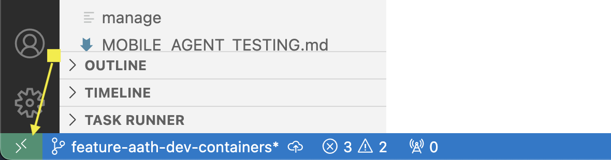
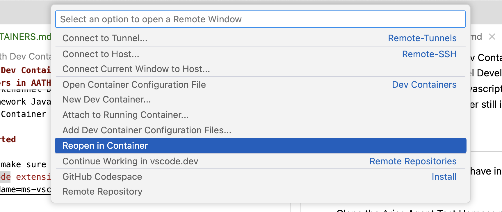

# Working with Dev Containers in AATH<!-- omit in toc -->

## Contents<!-- omit in toc -->
- [Dev Containers in AATH](#dev-containers-in-aath)
- [Getting Started](#getting-started)
- [Dev Container Configuration](#dev-container-configuration)

## Dev Containers in AATH

The Aries Agent Test Harness defines multiple [Dev Containers](https://code.visualstudio.com/docs/devcontainers/tutorial) to aid the test developer and the Backchannel/Controller developer. This allows the developers to write code for these areas without having to install all libraries and configure your local dev machine to write these tests or update an Aries Framework Backchannel. 

At the time of writing this document there are three Dev Containers in AATH.
- A Test Development Dev Container
- An ACA-Py Backchannel Development Dev Container
- An Aries Framework Javascript/CREDO-TS Backchannel Dev Container (Dev Container still in development)

## Getting Started

To get started make sure you have installed the [Dev Containers VSCode extension](https://marketplace.visualstudio.com/items?itemName=ms-vscode-remote.remote-containers) in VSCode. 

Clone the Aries Agent Test Harness repository and open the root folder in VS Code. Once opened, VS Code will detect the available dev containers and prompt you to open them. Selecting this option will display all the dev containers that you can choose from.


The other way to open the Dev Container is to select the `Open a Remote Window` option in the bottom of VSCode. 



Then select `Reopen in Container`



At the first time of opening a specific Dev Container, the container will be built. If a change is made in any of the dev containers configurations, the dev container will have to be rebuilt. VSCode should sense a change to these files and prompt a rebuild, but if not, or you don't accept the rebuild prompt at the time it appears, a rebuild can be initiated in VSCode within the dev container by clicking on the dev container name in the bottom left corner of VSCode and selecting Rebuild.   

## Dev Container Configuration

The dev container json files are located in `.devcontainer\`. This is where enhancements to existing dev containers and adding new dev containers for other Aries Frameworks would take place following the conventions already laid out in that folder.

The dev containers use an existing Dockerfile to build the image. These are not the regular docker files that are build with the AATH manage script. There are specific Dockerfiles for each dev container that are based on those original docker files but needed to be modified to work better with the dev container configurations. The Dockerfiles are named the same as the original files except with `dev` in the name. for example, the `Dockerfile.dev-acapy-main` was based off of `Dockerfile.acapy-main`.

These dev containers are named in Docker to allow for identification and better communications between agents. If you want an agent dev container to represent one of acme, bob, faber, or mallory, make sure the devcontainer.json is changed to name you want the agent to represent. 

```
	"runArgs": [
		"--network=aath_network",
		"--name=acme_agent"
	],
```

All dev containers are on the `aath_network` in docker which corresponds to the network that the regular agent containers are on when running the manage script. This allows the developer to run tests in a dev container against agents ran by the manage script, along with an agent running in a dev container communicating with other agents ran buy the manage script. 


