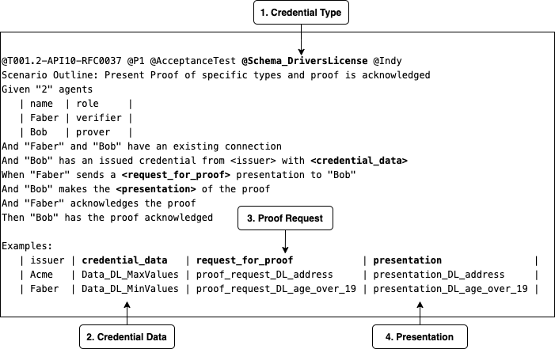

# Configuring Tests with Credential Types and Proofs<!-- omit in toc -->

## Contents<!-- omit in toc -->

-  [Default Test Credentials and the Need for More](#default-test-credentials-and-the-need-for-more)
-  [Defining Tests in Feature Files w/ Externalized Credential Info](#defining-tests-in-feature-files-with-externalized-credential-info)
-  [Credential Type Definitions](#credential-type-definitions)
-  [Credential Data](#credential-data)
-  [Proof Requests](#proof-requests)
-  [Proof Presentations](#proof-presentations)

## Default Test Credentials and the Need for More
Initially the Aries Agent Interop Tests were written with hard coded Credential Type Definitions, Credential Data for issued cedentials, and a canned Proof Request and Presentation of that Proof. This default behaviour for the tests is fine for quick cursory assessment of the protocol, however it was always a goal to provide a method of having this credential and proof input external to the tests, and to be able to quickly construct tests with different credential and proof data, driven from that external data.
Tests still remain that use the default hard coded credential input. Tests  like the Proof test below, make no mention of specific credentials or proofs. 
```
@T001-API10-RFC0037  @P1  @AcceptanceTest  @Indy
Scenario Outline: Present Proof where the prover does not propose a presentation of the proof and is acknowledged
Given "2" agents
| name  | role     |
| Faber | verifier |
| Bob   | prover   |
And "Faber" and "Bob" have an existing connection
And "Bob" has an issued credential from <issuer>
When "Faber" sends a request for proof presentation to "Bob"
And "Bob" makes the presentation of the proof
And "Faber" acknowledges the proof
Then "Bob" has the proof acknowledged

Examples:
| issuer |
| Acme   |
| Faber  |
```
 
## Defining Tests in Feature Files with Externalized Credential Info
Tests that have externalized input data for credentials and proofs look obviously different than the test above. They use Scenario tags and Example Data Tables to feed the test with input data. This input data is contains in json files located in `/aries-agent-test-harness/aries-test-harness/features/data`. 



 1. The *Credential Type* points to a file containing json that describes the credential in terms of what the types of data the credential contains, the schema, if you will. For the above you will find the `schema_driverslicense.json` file in `/aries-agent-test-harness/aries-test-harness/features/data`.
 2. The *Credential Data* points to the json contents of a file named cred_data_\<cred_type_name>. This file holds all data for all instances of credentials issued within the tests that use that credential type. For example. The example above will have a `cred_data_schema_driverslicense.json` file in `/aries-agent-test-harness/aries-test-harness/features/data`. This file will contain to sections, one for "Data_DL_MaxValues" and one for "Data_DL_MinValues".
 3. The *Proof Request* is a pointer to a json file that describes the proof request to be sent to the agent. In the case above there will be a `proof_request_DL_address.json` and a `proof_request_DL_age_over_19.json` file in `/aries-agent-test-harness/aries-test-harness/features/data`.
 4. The *Presentation* is a pointer to a json file that contains the necessary information to present the proof. Above, one will find the `presentation_DL_address.json` and `presentation_DL_age_over_19.json` in `/aries-agent-test-harness/aries-test-harness/features/data`.

Some conventions are in place here that make it workable. 

 - The Credential Type tag, as an overarching scenario outline tag, is meant to constrain all the scenarios built from the examples data table, to the credential types defined in those tags. The example above has one credential type, drivers license, but multiple credential types are supported in the test harness if the proof request requires multiple credentials. More on that in a moment.
 - The example data tables are used to build out different scenarios that use the credential types. Each row being a different scenario. There can be different credential data, along with a different proof request/presentation in each row.
 - Based off of this data in a scenario outline, the test harness will facilitate the creation of what the issuer needs to be able to issue that credential. The agent's backchannel may need to do a little extra work to accomplish this. For example for Aca-py the Aca-py backchannel creates the credential schema along with the credential definition to get public DID.

### Handling Multiple Credentials in a Proof
Proof Requests can contain requests from multiple credentials from the holder.  The Test Harness will create the credential types for as many credential types listed as tags for the scenario. For example, below is an example of a scenario that will utilize two credentials in its proofs; Biological Indicators and Health Consent.
```
@T001.4-API10-RFC0037  @P1  @AcceptanceTest  @Schema_Biological_Indicators  @Schema_Health_Consent  @Indy
Scenario Outline: Present Proof of specific types and proof is acknowledged
Given "2" agents
| name  | role     |
| Faber | verifier |
| Bob   | prover   |
And "Faber" and "Bob" have an existing connection
And "Bob" has an issued credential from <issuer> with <credential_data>
When "Faber" sends a <request for proof> presentation to "Bob"
And "Bob" makes the <presentation> of the proof
And "Faber" acknowledges the proof
Then "Bob" has the proof acknowledged

Examples:
| issuer | credential_data      | request for proof            | presentation                |
| Faber  | Data_BI_HealthValues | proof_request_health_consent | presentation_health_consent |
```
In this scenario before the scenario starts 2 credential types are created for the issuer to be able to issue. The `credential_data` points to a section named Data_BI_HealthValues in each cred_data_\<schema>.json file, and those two credentials are issued to the holder on step `And "Bob" has an issued credential from <issuer> with <credential_data>` The `request for proof` points to one json file that hold the request that contains data from both credentials. The `presentation` obviously is the presentation by the holder of the proof using the 2 credentials.

This pattern will work and can be extended for as many credentials as are needed for a presentation test.

## Credential Type Definitions
The following are the basics in defining a Credential Type. It really just consists of a name, a version and the actual attributes of the credential. It also contains a section to set the credential defintion revocation support if needed.  To reiterate, this is contained in a Schema_\<schema_name>.json file in `/aries-agent-test-harness/aries-test-harness/features/data`. Follow this pattern to create new tests with different credential types.
```
{
"schema":{
   "schema_name":"Schema_DriversLicense",
   "schema_version":"1.0.1",
   "attributes":[
      "address",
      "DL_number",
      "expiry",
      "age"
   ]
},
"cred_def_support_revocation":false
}
```


## Credential Data
The credential data json file references the credential type name in the main scenario tag. ie cred_data_\<schema_name>.json. This file holds sections of data that references the name in the examples data table. There needs to be a section that references this name, for ever name mentioned in the test or across other tests that use that credential. na
```
{
"Data_DL_MaxValues":{
   "cred_name":"Data_DriversLicense_MaxValues",
   "schema_name":"Schema_DriversLicense",
   "schema_version":"1.0.1",
   "attributes":[
      {
         "name":"address",
         "value":"947 this street, Kingston Ontario Canada, K9O 3R5"
      },
      {
         "name":"DL_number",
         "value":"09385029529385"
      },
      {
         "name":"expiry",
         "value":"10/12/2022"
      },
      {
         "name":"age",
         "value":"30"
      }
   ]
},
"Data_DL_MinValues":{
   "cred_name":"Data_DriversLicense_MaxValues",
   "schema_name":"Schema_DriversLicense",
   "schema_version":"1.0.1",
   "attributes":[
      {
         "name":"address",
         "value":"9"
      },
      {
         "name":"DL_number",
         "value":"0"
      },
      {
         "name":"expiry",
         "value":"10/12/2022"
      },
      {
         "name":"age",
         "value":"20"
      }
   ]
}
}
```
## Proof Requests
The following is an example of a simple proof request for one attribute with some restrictions.
```
{
   "presentation_proposal": {
      "requested_attributes": {
         "address_attrs": {
            "name": "address",
            "restrictions": [
               {
                  "schema_name": "Schema_DriversLicense",
                  "schema_version": "1.0.1"
               }
            ]
         }
      },
      "version": "0.1.0"
   }
}
```
The following is an example of a proof request using more than one credential.
```
{
   "presentation_proposal": {
      "name": "Health Consent Proof",
      "requested_attributes": {
         "bioindicators_attrs": {
            "names": [
               "name",
               "range",
               "concentration",
               "unit",
               "concentration",
               "collected_on"
            ],
            "restrictions": [
               {
                  "schema_name": "Schema_Biological_Indicators",
                  "schema_version": "0.2.0"
               }
            ]
         },
         "consent_attrs": {
            "name": "jti_id",
            "restrictions": [
               {
                  "schema_name": "Schema_Health_Consent",
                  "schema_version": "0.2.0"
               }
            ]
         }
      },
      "requested_predicates": {},
      "version": "0.1.0"
   }
}
```

## Proof Presentations
Proof Presentations are straight forward as in the example below. The only thing to note is the cred_id is created during the execution of the test scenario, so there is no way to know it beforehand and have it inside the json file. The test harness takes care of this and swaps in the actual credential id from the credential issued to the holder. To do this change the test harness needs to know what the credential type name is in order to pick the correct cred_id for credential. 
```
{
   "presentation": {
      "comment": "This is a comment for the send presentation.",
      "requested_attributes": {
         "address_attrs": {
            "cred_type_name": "Schema_DriversLicense",
            "revealed": true,
            "cred_id": "replace_me"
         }
      }
   }
}
```
The following is an example of a presentation with two credentials. 
```
{
   "presentation": {
      "comment": "This is a comment for the send presentation for the Health Consent Proof.",
      "requested_attributes": {
         "bioindicators_attrs": {
            "cred_type_name": "Schema_Biological_Indicators",
            "cred_id": "replace me",
            "revealed": true
         },
         "consent_attrs": {
            "cred_type_name": "Schema_Health_Consent",
            "cred_id": "replace me",
            "revealed": true
         }
      },
      "requested_predicates": {},
      "self_attested_attributes": {}
   }
}
```

## Conclusion
With the constructs above is should be very easy to add new tests based off of new credentials. Essentially, once the json files are created, opening the present proof feature file, copying and pasting one of these tests, incrementing the test id, and replacing the credential type tags and data table names, should have a running test scenario with those new credentials. 

As we move forward and non Aca-py Agents are used in the test harness, some of the nomenclature may change in the json file to generalize those names, however it will still be essential for the agent's backchannel to translate that json into whatever the agent is expecting to accomplish the goals of the test steps. 