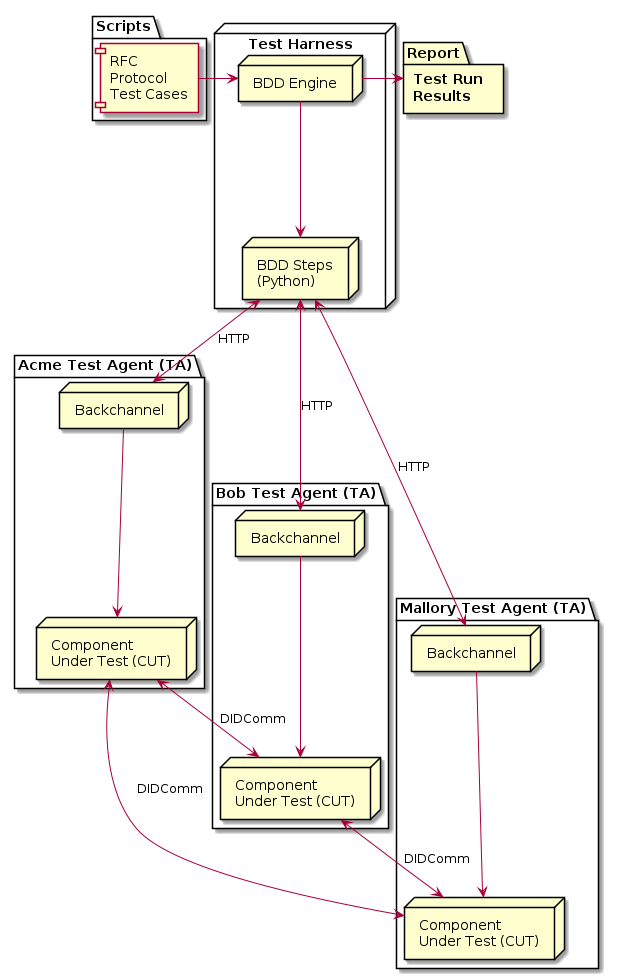

[](LICENSE)

# Aries Agent Test Harness: Smashing Complexity in Interoperability Testing<!-- omit in toc -->

The Aries Agent Test Harness (AATH) is a [BDD](https://en.wikipedia.org/wiki/Behavior-driven_development)-based test execution engine and set of tests for evaluating the interoperability of Aries Agents and Agent Frameworks. The tests are agnostic to the components under test but rather are designed based on the [Aries RFCs](https://github.com/hyperledger/aries) and the interaction protocols documented there. The AATH enables the creation of an interop lab much like the [labs](https://www.iol.unh.edu/) used by the telcos when introducing new hardware into the markets&mdash;routers, switchers and the like. Aries agent and agent framework builders can easily incorporate these tests into the their CI/CD pipelines to ensure that interoperability is core to the development process.

Want to see the Aries Agent Test Harness in action? Give it a try using a git and bash enabled system, or run it in your browser using Play with Docker (startup instructions [here](https://github.com/cloudcompass/ToIPLabs/blob/master/docs/LFS173x/RunningLabs.md#running-on-play-with-docker)). Once you are in a bash shell (local or using Play with Docker), run the following commands to execute a set of RFC tests using the [Aries Cloud Agent - Python](https://github.com/hyperledger/aries-cloudagent-python):

```bash
git clone https://github.com/bcgov/von-network
cd von-network
./manage build
./manage start
cd ..
git clone https://github.com/bcgov/aries-agent-test-harness
cd aries-agent-test-harness
./manage build -a acapy -a dotnet
./manage run -d acapy -b dotnet -t @AcceptanceTest -t ~@wip

```
If running the Credential Revocation tests, which the `./manage run -d acapy -t @AcceptanceTest -t ~@wip` command does, make sure the Tail Server is running.
```bash
git clone https://github.com/bcgov/indy-tails-server
cd indy-tails-server/docker
./manage start
```

The commands take a while to run (you know...building modern apps always means downloading half the internet...), so while you wait, here's what's happening:

- The `von-network` commands are building and starting a docker-ized Hyperledger Indy network needed for some of the tests.
- The AATH `./manage build` command builds docker images for testing the ACA-Py and .NET agent frameworks and the test harness.
- The AATH `./manage run` command executes a set of tests (those tagged "AcceptanceTest" but not tagged "@wip") with the ACA-Py test agent playing most of the roles&mdash;Acme, Faber and Mallory, while the .NET test agent plays the role of Bob.

It's that last part makes the AATH powerful. On every run, different AATH-enabled components can be assigned any role (Acme, Bob, Faber, Mallory and others to come, like Carol). For some initial pain (AATH-enabling a component), interoperability testing becomes routine, and we can make hit our goal: to make interoperability boring.

Interesting to you? Read on for more about the architecture, how to build tests, how to AATH-enable the Aries agents and agent frameworks that you are building and how you can run these tests on a continuous basis. For a brief set of slides covering the process and goals, check [this](https://docs.google.com/presentation/d/1tNttxlHE8iwyOr7LDOZ6VrCwh8AuINfzuI2Gl0WEld0/edit?usp=sharing) out.

We'd love to have help in building out a full Aries interoperability lab.

## Contents<!-- omit in toc -->

- [Architecture](#architecture)
- [Aries Agent Test Harness Terminology](#aries-agent-test-harness-terminology)
- [Test Script Guidelines](#test-script-guidelines)
- [Aries Agent Backchannels](#aries-agent-backchannels)
  - [Implemented Backchannels](#implemented-backchannels)
- [The `manage` bash script](#the-manage-bash-script)
- [Test Tags](#test-tags)
  - [Running Tagged Tests](#running-tagged-tests)

## Architecture

The following diagram provides an overview of the architecture of the AATH.



- All of the executable elements run in docker containers.
- The components-under-test (e.g. Acme, Bob and Mallory) are externally identical, enabling the selection of the components to be tested a runtime decision.
  - An identical HTTP interface exists between the test harness and each test docker container.
  - A "backchannel" within each test container handles the commands from the test harness, converting them into actions understood by the agent or agent framework.
    - This is the hard part&mdash;creating a backchannel for each agents/agent frameworks
- The general roles of the test participants are:
  - Acme: an enterprise issuer/verifier
  - Bob: a holder/prover
  - Faber: another enterprise issuer/verifier
  - Mallory: a malicious holder/prover
  - Other roles are likely to be added, such as Carol (another holder/prover) and perhaps even Thing (an IOT device).
- The test harness is the Python [behave](https://behave.readthedocs.io/en/latest/) engine, with the "features" (as they are called in BDD-speak) written in [Gherkin](https://behave.readthedocs.io/en/latest/gherkin.html#gherkin-feature-testing-language) and the feature steps in Python.
- Dockerfiles are used to package the backchannel and the component under test (an agent or agent framework) into a single container image with a pre-defined set of port mappings.
  - One of the ports is for the test harness to backchannel interface and the rest can be used as needed by the component under test and it's backchannel.
- At test execution time, command line parameters enable the selection of any of the docker images to be used to play any of the test case roles. Further, a flexible test case tagging mechanism enables command line (or configuration file) selection of the tests cases to be run.
  - Since the components being tested will have different capabilities (e.g. issuer, prover, verifier), they may only be selected to play certain roles. For example, a mobile agent app might only play the roles of Bob and Mallory, and never be selected to play the role of Acme.
  - Likewise, only some tests will be selected for execution based on the interoperable capabilities of the components being tested.
- A bash script (`./manage`) processes the command line options and orchestrates the docker image building and test case running.

## Aries Agent Test Harness Terminology

There are a couple of layers of abstraction involved in the test harness architecture, and it's worth formalizing some terminology to make it easier to communicate about what's what when we are are running tests.

- **Test Harness**: An engine that executes the selected tests and collects the results.
- **Backchannel**: A piece of integration software that receives HTTP requests from the Test Harness and interacts with the agent or agent framework under test to execute the requests. A backchannel is needed for each agent or agent framework. The same backchannel will likely work for multiple agent and agent framework versions and/or configurations.
- **Components under Test (CUTs)**: external Aries agents or agent frameworks being tested.
  - The CUT might be an agent framework like aries-framework-dotnet or aries-cloudagent-python. In those cases, the backchannel is a controller that directly operates an instance of the agent framework.
  - The CUT might be a full agent; a combination of an agent framework instance and a controller. In those cases, the backchannel must be able to operate the controller, which in turn controls the agent framework. For example, a mobile agent has a user interface (a controller), perhaps with some automation rules. Its' AATH backchannel will interact with the controller, not the agent framework directly.
  - There may be multiple CUTs that operate with a single backchannel. For example, different configurations of an agent framework or different versions.
- **Test Agent (TA)**: The combined instance of a CUT and a backchannel, instantiated as a single docker image.

## Test Script Guidelines

AATH test scripts are written in the [Gherkin](https://behave.readthedocs.io/en/latest/gherkin.html#gherkin-feature-testing-language) language, using the python [behave](https://behave.readthedocs.io/en/latest/) framework. Guidelines for writing test scripts are located [here](./TEST_DEV_GUIDE.md).

## Aries Agent Backchannels

Backchannels are the challenging part of the AATH. In order to participate in the interoperability testing, each CUT builder must create and maintain a backchannel that converts requests from the test engine into commands for the component being tested. In some cases, that's relatively easy, such as with [Aries Cloud Agent - Python](https://github.com/hyperledger/aries-cloudagent-python). An ACA-Py controller uses an HTTP interface to control an ACA-Py instance, so the backchannel is almost a proxy from the Test Harness to to the ACA-Py instance being tested. In other cases, it may be more difficult, calling for the component being tested to be embedded into a web service. And we've not yet even tried to use a backchannel to drive a mobile app simulator...

A further complication is that as tests are added to the test suite, the backchannel interface expands, requiring that backchannel maintainers extend their implementation to be able to run the new tests. Note that the test engine doesn't fail if the backchannel steps are not implemented, just that such tests will be marked as `fail`ing on test runs, usually with an HTTP `404` error.

### Implemented Backchannels

Backchannels can be found in the [`aries-backchannels`](aries-backchannels) folder of this repo. For more information on building a backchannel, see the documentation in the [`aries-backchannels` README](aries-backchannels/README.md), and look at the code of the existing backchannels. To get help in building a backchannel for a component you want tested, please use GitHub issues and/or ask questions on the [Hyperledger Rocketchat](https://chat.hyperledger.org) `#aries-agent-test-harness` channel (free Linux Foundation account required).

Three backchannels have been implemented, for the [ACA-PY](https://github.com/hyperledger/aries-cloudagent-python), [VCX](https://github.com/hyperledger/indy-sdk/tree/master/vcx) and [.NET](https://github.com/hyperledger/aries-framework-dotnet) Aries agent frameworks. The ACA-Py and VCX are built on a common Python base (./aries-backchannels/python/aries_backchannel.py) that sets up the backchannel API listener and performs some basic request validation and dispatching. The ACA-PY (./aries-backchannels/acapy/acapy_backchannel.py) and VCX (./aries-backchannels/vcx/vcx_backchannel.py) implementations extend the base to add support for their respective agent frameworks.

## The `manage` bash script

The AATH `./manage` script in the repo root folder is used to manage running builds of TA images and initiate test runs. Running the script with no arguments or just `help` to see the script's usage information. The following summarizes the key concepts.

`./manage` is a bash script, so you must be in a bash compatible shell to run the AATH. You must also have an operational docker installation and git installed. Pretty normal stuff for Aries Agent development. As well, the current AATH requires access to a running Indy network. A locally running instance of [VON-Network](https://github.com/bcgov/von-network) is one option, but you can also pass in environment variables for the LEDGER_URL, GENESIS_URL or GENESIS_FILE to use a remote network. For example `GENESIS_URL=

Before running tests, you must build the TA and harness docker images. Use `./manage build -a <TA>` to build the docker images for a TA, and the test harness itself. You may specify multiple `-a` parameters to build multiple TAs at the same time. Leaving off the `-a` option builds docker images for all of the TAs found in the repo.

There are two options for testing [ACA-PY](https://github.com/hyperledger/aries-cloudagent-python) - you can build and run `acapy`, which builds the backchannel based on the latest released code, or you can build and run `acapy-master`, which builds the backchannel based on the latest version of the `master` branch.  (Note that to build the backchannel based on a different repo/branch, edit [this file](https://github.com/hyperledger/aries-agent-test-harness/blob/master/aries-backchannels/acapy/requirements-master.txt) to specify the repo/branch you want to test, and then build/run `acapy-master`.)

To run the tests, use the `./manage run...` sub-command. the `run` command requires defining what TAs will be used for Acme (`-a <TA>`), Bob (`-b <TA>`) and Mallory (`-m <TA>`). To default all the agents to use a single component, use `-d <TA>`. Parameters are processed in order, so you can use `-d` to default the agents to one, and then use `-b` to use a different TA for Bob.

There are two ways to control the behave test engine's selection of test cases to run. First, you can specify one or more `-t <tag>` options to select the tests associated with specific tags. See the guidance on using tags with behave [here](https://behave.readthedocs.io/en/stable/behave.html#tag-expression). Note that each `-t` option is passed to behave as a `--tags <tag>` parameter, enabling control of the ANDs and ORs handling of tags. To get a full list of possible tags to use in this run command, use the `./manage tags` command.

> Note that the `<tag>` arguments passed in on the command line **cannot** have a space, even if you double-quote the tag or escape the space. This is because the args are going through multiple layers shells (the script, calling docker, calling a script in the docker instance that in turn calls behave...). In all that argument passing, the wrappers around the args get lost. That should be OK in most cases, but if it is a problem, we have the `-i` option as follows...

To enable full control over behave's behaviour (if you will...), the `-i <ini file>` option can be used to pass a behave "ini" format file into the test harness container. The ini file enables full control over the behave engine, add handles the shortcoming of not being able to pass tags arguments with spaces in them. See the behave configuration file options [here](https://behave.readthedocs.io/en/stable/behave.html#configuration-files). Note that the file name can be whatever you want. When it lands in the test harness container, it will be called `behave.ini`. There is a default ini file located in `aries-agent-test-harness/aries-test-harness/behave.ini`. This ini file is picked up and used by the test harness without the -i option.  To run the tests with a custom behave ini file, follow this example,
 ```
 ./manage run -d acapy -t @AcceptanceTest -t ~@wip -i aries-test-harness/MyNewBehaveConfig.ini
 ```

For a full inventory of tests available to run, use the `./manage tests`. Note that tests in the list tagged @wip are works in progress and should not run.

## Test Tags

The test harness has utilized tags in the BDD feature files to be able to narrow down a test set to be executed at runtime. The general AATH tags currently utilized are as follows:

- @AcceptanceTest - Tests based on requirements specifically stated in the RFC
- @DerivedFunctionalTest - Tests derived on requirements but not specifically stated in the RFC.
- @P1 - Test Priority
- @P2 - Test Priority
- @P3 - Test Priority
- @P4 - Test Priority
- @NegativeTest - Test that attempts to break the software. ie. change workflow order, use invalid data, etc.
- @ExceptionTest - Tests that are based on requirements that suggest exception cases.
- @SmokeTest - Tests that can be used as a builds smoke or sanity tests.
- @NeedsReview - Tests that have not been reviewed or approved.
- @ReviewedApproved - obvious
- @wip - Tests that are a work in progress and incomplete
- @Done - Finished tests that are expected to Pass if executed against an Agent.
- @AIP10 - Aries Interop Profile version the tests are written for
- @T01-AIP10-RFC0160 - Test Unique Identifier

Proposed Connection Protocol Tags

- @MultiUseInvite - Test utilizes a multi-use invite. Not using this tag and the test expects the invite to be single use.
- @SingleTryOnException
- @RetryableOnException

To get a list of all the tags in the current test suite, run the command: `./manage tags`

To get a list of the tests (scenarios) and the associated tags, run the command: `./manage tests`

### Running Tagged Tests

Using tags, one can just run Acceptance Tests...

``` bash
./manage run -d acapy -t @AcceptanceTest
```

or all Priority 1 Acceptance Tests, but not the ones flagged Work In Progress...

``` bash
./manage run -d acapy -t @P1 -t @AcceptanceTest -t ~@wip
```

or derived functional tests

``` bash
./manage run -d acapy -t @DerivedFunctionalTest
```

or all the ExceptionTests...

``` bash
./manage run -t @ExceptionTest
```

To read more on how one can control the execution of test sets based on tags see the [behave documentation](https://behave.readthedocs.io/en/stable/tutorial.html#controlling-things-with-tags)

The option `-i <inifile>` can be used to pass a file in the `behave.ini` format into behave. With that, any behave configuration settings can be specified to control how behave behaves. See the behave documentation about the `behave.ini` configuration file [here](https://behave.readthedocs.io/en/stable/behave.html#configuration-files).

### Test Coverage
To read about what protocols and features from Aries Interop Profile 1.0, see the [Test Coverage Matrix](./TEST-COVERAGE.md). 

### Test Reporting
For information on enhanced test reporting with the Aries Agent Test Harness, see [Advanced Test Reporting](./TEST-REPORTING.md).